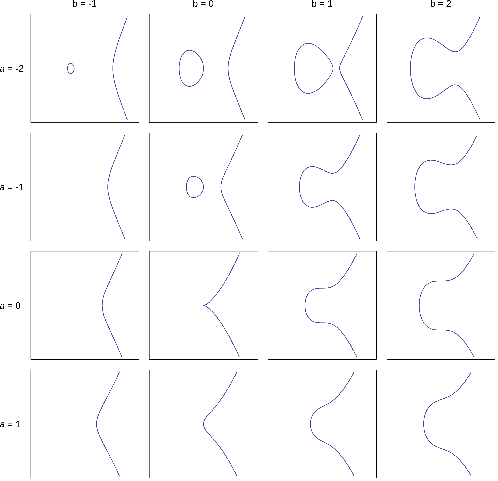

## Intuitive Introduction of Mathematic Fundamentals

As a developer with less interest to mathematics, I think it's enough to outline the properties and characteristics of the mathematical foundations, but not the foundational principles and intricate proofs. So I will only bring readers intuitive views about the mathematical fundamentals. You can also switch to Wikipedia, etc. to delve deeper into the maths.

### Elliptic Curve Cryptography

The following is the definition of elliptic curve cryptography on Wikipedia:

> Elliptic curve cryptography (ECC) is an approach to public-key cryptography based on the algebraic structure of elliptic curves over finite fields. ECC allows smaller keys to provide equivalent security, compared to cryptosystems based on modular exponentiation in finite fields, such as the RSA cryptosystem and ElGamal cryptosystem.

To be honest, for developers without a background in cryptography and cybersecurity, this definition can be somewhat impenetrable. However, following some preliminary scoping, I can offer a more intuitive perspective.

At their core, all modern cryptographic algorithms rely on some computationally hard, one-way mathematical problems. For instance, RSA is based on the disparity between large integer multiplication (easy) and prime factorisation (hard), while ECC is based on the disparity between point multiplication (easy) and discrete logarithm problem (hard) on elliptic curves.

So, what is the discrete logarithm problem on elliptic curves?

According to elementary mathematics, logarithm is the inverse operation of exponentiation. For example, if $a^b = N$, then $\log_a N = b$, this is logarithm in real number field, and hence real number is continuous, this logarithm is literally continuous logarithm. In the real number field, we can use some calculus-based method, such as Newton's method and Taylor series, to solve exponetiation and logarithm problems, so they're exactly both easy to solve.

Before introducing discrete logarithm problem on elliptic curves, I must clarify a crucial point: Elliptic curves ($y^2 = x^3 + ax + b$) are inherently continuous. However, in the context of ECC, we restrict these curves into a finite field, rendering the set of points discrete. Furthermore, the inverse operation of discrete logarithm on elliptic curves is typically denoted as scalar multiplication, such as $S = aG$, which can be a source of confusion.

